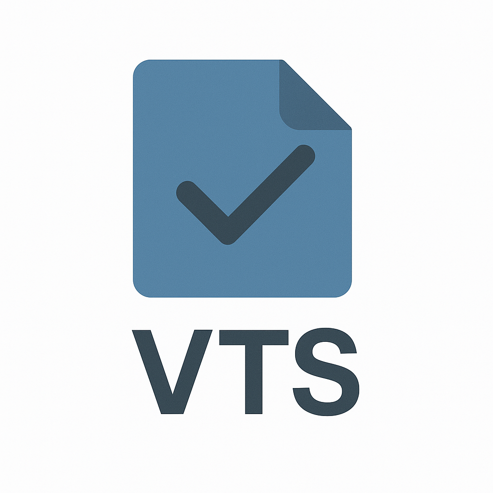
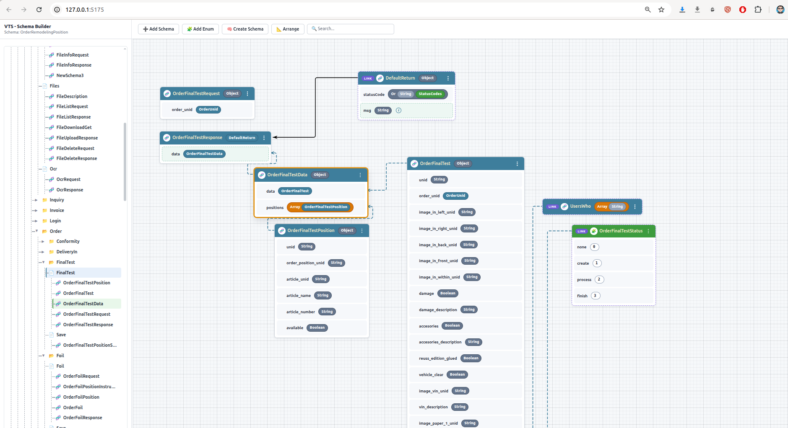
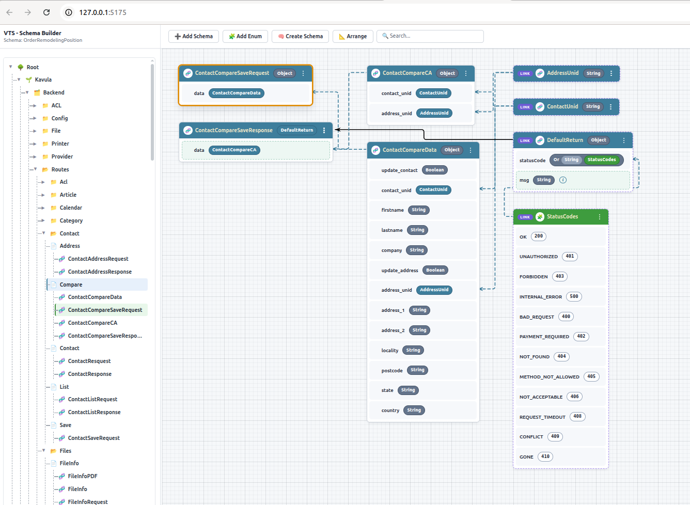
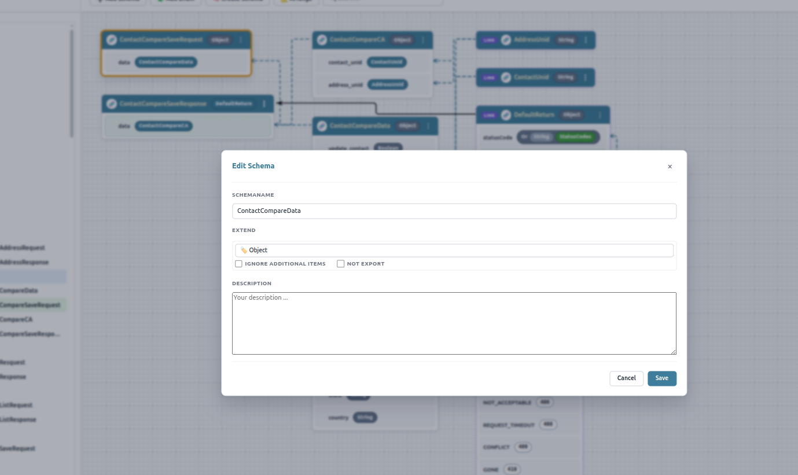
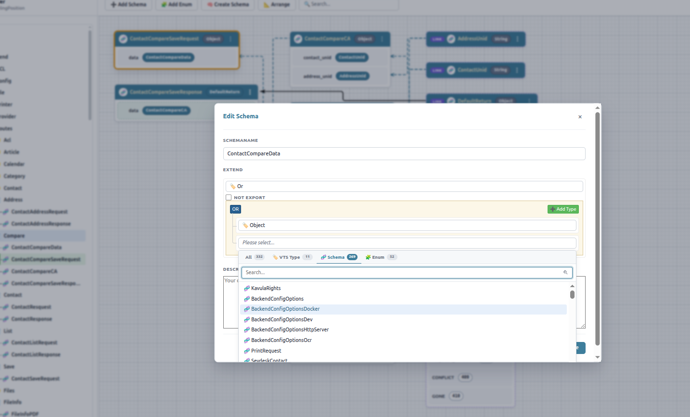
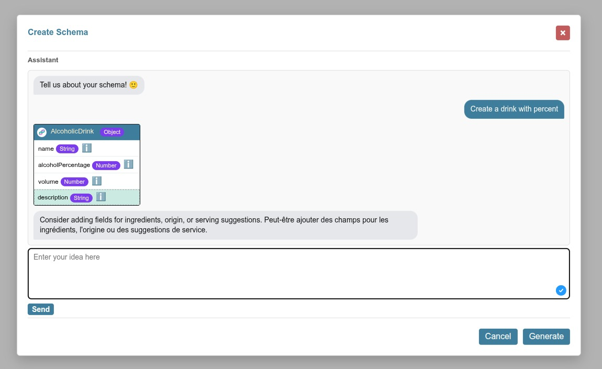

<div align="center">



# VTS Editor

### Visual schema design for [VTS](https://github.com/OpenSourcePKG/vts) — draw your types, ship validated TypeScript.

[](https://discord.gg/52PQ2mbWQD)
[](https://deepwiki.com/stefanwerfling/vtseditor)


[Getting started](#-getting-started) ·
[Features](#-features) ·
[Generated code](#-generated-output) ·
[AI providers](#-ai-providers) ·
[MCP server](#-mcp-server) ·
[Config reference](doc/Config.md)

</div>

---

## What is this?

**VTS Editor** is a browser-based visual editor for building [VTS](https://github.com/OpenSourcePKG/vts) type-validation schemas — the runtime validators behind `Vts.object(...)`, `Vts.string(...)` & friends. Sketch your types on a canvas, wire them up visually, and the editor emits fully-typed `.ts` files with matching VTS schemas and extracted TypeScript types.

Ships as a tiny CLI (`npx vtseditor`) that runs inside **your own project**, reads/writes a single `schema.json`, and regenerates the TypeScript on save.

---

## ✨ Features

<table>
<tr>
<td width="50%" valign="top">

### 🎨 Visual design
- Drag-and-drop schema canvas
- Folder / file tree, groups, links
- Inheritance, nested objects, `or`-types
- Auto-layout + search

</td>
<td width="50%" valign="top">

### ⚙️ Code generation
- Strict `Vts.object(...)` + extracted `type`
- Enums, cross-file imports
- Extern packages (read-only) via `node_modules`
- Pre/post generation hooks

</td>
</tr>
<tr>
<td width="50%" valign="top">

### 🧠 AI assist
- Generate schemas from a natural-language description
- Gemini · OpenAI · Anthropic · Claude Code · LocalAI
- Conversation history compressed with **TOON** for token efficiency

</td>
<td width="50%" valign="top">

### 🤖 MCP server
- Expose 27 `vts_*` tools over HTTP
- Claude CLI, Cursor, any MCP client can read & mutate schemas
- Same commit pipeline as the UI — browser tab stays in sync via SSE

</td>
</tr>
<tr>
<td width="50%" valign="top">

### 💾 Sticky workspace
- Remembers the active schema/file you were on
- Remembers which folders you collapsed
- Multi-tab safe (SSE live-sync)

</td>
<td width="50%" valign="top">

### 🧰 Zero build step
- Node ≥ 20 · ESM · TypeScript 5.x
- No compile, no bundler config
- `vtseditor.json` validated on startup — bad config aborts the server

</td>
</tr>
</table>

---

## 📸 Screenshots

<table>
<tr>
<td align="center" width="50%"><br /><sub><b>Schema on the canvas</b></sub></td>
<td align="center" width="50%"><br /><sub><b>Schema with extend</b></sub></td>
</tr>
<tr>
<td align="center" width="50%"><br /><sub><b>Schema editor</b></sub></td>
<td align="center" width="50%"><br /><sub><b>Field editor</b></sub></td>
</tr>
<tr>
<td align="center" colspan="2"><br /><sub><b>AI-assisted schema creation</b></sub></td>
</tr>
</table>

---

## 🚀 Getting started

### 1 · Install

<details open>
<summary><b>From npm</b> (recommended)</summary>

```bash
# in your project
npm install --save-dev vtseditor

# or globally
npm install -g vtseditor
```

</details>

<details>
<summary><b>From GitHub</b> (main branch)</summary>

```bash
# in your project
npm install --save-dev git+https://github.com/stefanwerfling/vtseditor.git

# or globally
npm install -g git+https://github.com/stefanwerfling/vtseditor.git
```

</details>

### 2 · Drop a `vtseditor.json` at your project root

```jsonc
{
  "projects": [
    {
      "schemaPath": "./schemas/schema.json",
      "destinationPath": "./schemas/src",
      "destinationClear": false,
      "autoGenerate": false,
      "code": {
        "schemaPrefix": "Schema",
        "createTypes": true,
        "createIndex": true,
        "codeComment": true,
        "codeIndent": "    "
      },
      "scripts": {
        "before_generate": [],
        "after_generate": [
          { "path": "./schemas", "script": "npm run compile" }
        ]
      }
    }
  ],
  "server":  { "port": 5173 },
  "browser": { "open": true }
}
```

> Full reference in **[`doc/Config.md`](doc/Config.md)** — including AI providers ([`doc/ConfigAI.md`](doc/ConfigAI.md)) and MCP ([`doc/ConfigMcp.md`](doc/ConfigMcp.md)).

### 3 · Launch

```bash
npx vtseditor
```

The editor opens at **http://localhost:5173**. Create a schema, hit save, and the `.ts` files appear under `destinationPath`.

---

## 📄 Generated output

Every schema on the canvas becomes a pair of runtime validator + TypeScript type:

```ts
// auto-generated imports
import {ExtractSchemaResultType, Vts} from 'vts';
import {ProfileSchema} from './relative/path.js';
import {ExternalSchema} from 'external-package';

// enums ------------------------------------------------
export enum StatusEnum {
    'active' = 'active',
    'inactive' = 'inactive',
}

// schema + options ------------------------------------
export const UserSchema = Vts.object({
    id:      Vts.string({description: 'User identifier'}),
    status:  Vts.enum(StatusEnum),
    profile: ProfileSchema,
}, {
    description: 'User entity schema',
    objectSchema: {
        ignoreAdditionalItems: true
    }
});

// matching TS type ------------------------------------
export type User = ExtractSchemaResultType<typeof UserSchema>;
```

Runtime validation for free, `User` is the inferred shape — swap in your favourite boundary check:

```ts
const errors: SchemaErrors = [];

if (!UserSchema.validate(payload, errors)) {
    throw new ValidationError(errors);
}

// payload is typed as User from here on
```

---

## 🧠 AI providers

Tell the editor what you want in plain English; it drafts a schema for you. Supported out of the box:

| Provider | Type | Notes |
|---|---|---|
| **Anthropic** | API key | `claude-sonnet-4-5` default |
| **Claude Code** | Local CLI | Uses the `claude` binary you already have |
| **OpenAI** | API key | Any chat-completions model |
| **Gemini** | Google AI Studio | |
| **LocalAI** | Self-hosted | OpenAI-compatible endpoint |

Past assistant turns replayed in the conversation are re-encoded as **TOON** ([Token-Oriented Object Notation](https://toonformat.dev)) to shave ~25–30 % of tokens off the replay cost. Config details → **[`doc/ConfigAI.md`](doc/ConfigAI.md)**.

---

## 🤖 MCP server

Flip on the [Model Context Protocol](https://modelcontextprotocol.io/) endpoint and your favourite AI agent edits the exact same schema file the browser editor does — no detour through the UI, no separate lock file.

```jsonc
// vtseditor.json
{
  "projects": [ /* ... */ ],
  "mcp": {
    "enabled": true
  }
}
```

Start the editor (`npx vtseditor`); the endpoint lives at `http://localhost:5173/mcp`. Point Claude CLI at it:

```jsonc
{
  "mcpServers": {
    "vtseditor": {
      "type": "http",
      "url": "http://localhost:5173/mcp"
    }
  }
}
```

**27 `vts_*` tools** are exposed — list projects, walk the tree, create/update/delete/move folders · files · schemas · fields · enums · enum values · links, force regeneration. Every mutation goes through the same commit pipeline as the browser; an open editor tab picks remote changes up automatically via SSE.

Full list & wiring → **[`doc/ConfigMcp.md`](doc/ConfigMcp.md)**.

---

## 🧱 Built on VTS

VTS is a tiny, strict, TypeScript-native data-type validator. Schemas are composable classes, field checks are type guards, and boundary validation (`Schema.validate()`) is the only runtime cost. VTS Editor is the graphical front-end; the library stands on its own:

➡️ **[github.com/OpenSourcePKG/vts](https://github.com/OpenSourcePKG/vts)**

---

## 🤝 Contributing

Issues, suggestions, and pull requests are welcome — join the [Discord](https://discord.gg/52PQ2mbWQD) to chat first if you're planning a bigger change.

---

## 💙 Supported by

<!-- prettier-ignore-start -->
<!-- markdownlint-disable -->
<table>
<tr>
<td align="center">
<a href="https://jb.gg/OpenSourceSupport">

<br /><sub><b>JetBrains</b></sub>
</a>
</td>
<td align="center">
<a href="https://github.com/OpenSourcePKG">

<br /><sub><b>Pegenau GmbH & Co. KG</b></sub>
</a>
</td>
</tr>
</table>
<!-- markdownlint-enable -->
<!-- prettier-ignore-end -->

## 👥 Contributors

<!-- prettier-ignore-start -->
<!-- markdownlint-disable -->
<table>
<tr>
<td align="center">
<a href="https://github.com/Choppel">

<br /><sub><b>Choppel</b></sub>
</a>
</td>
</tr>
</table>
<!-- markdownlint-enable -->
<!-- prettier-ignore-end -->