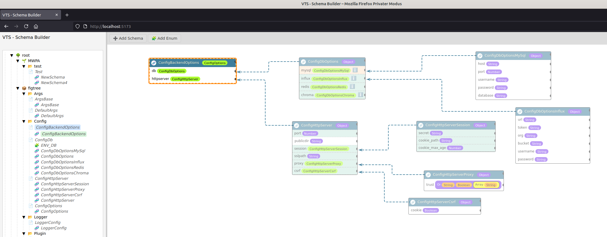
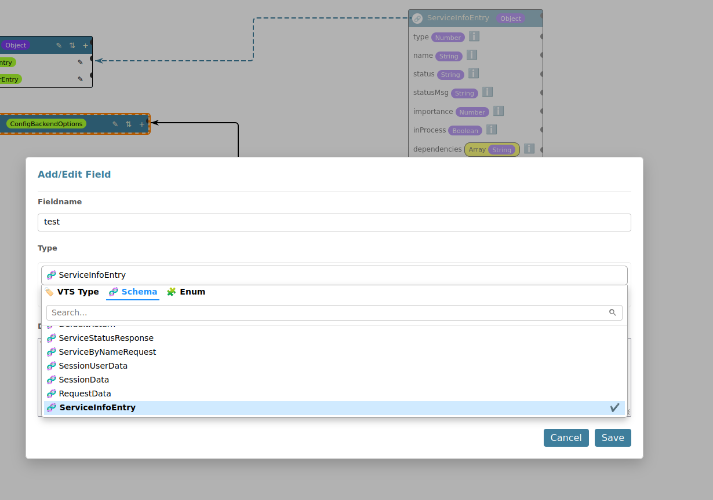

# VTS & VTS-Editor

[](https://discord.gg/52PQ2mbWQD) [](https://deepwiki.com/stefanwerfling/vtseditor)

<hr>

## 📦 VTS — Type-Safe Data Validation in TypeScript
<p align="center">

<br><br>
Vts is a data type validation library written entirely in TypeScript. Its main focus lies on validating the types of the
given data (e.g. "is x a string") and not so much on validating the data itself (e.g. "is the length of the string x
equal to y") to ensure that external data is compatible with your own source code.
<br><br>
The package consists of some basic type guarded validator methods like isString() and isFunction() that can be accessed
via the main Vts object. Most of these validators are also encapsulated in schema classes which can be used to create
complex schemas. The main strategy when validating those complex schemas is to be as strict as possible.
</p>

### 🧰 Key Features
* ✅ Simple validators like isString(), isFunction(), etc.
* 🧠 Strict type guards for maximum safety and reliability.
* 🧱 Composable schema classes for defining structured, reusable validation logic.
* 💡 Built with TypeScript types in mind — works seamlessly with typeof, instanceof, and conditional typing.

[Read more by VTS project: https://github.com/OpenSourcePKG/vts](https://github.com/OpenSourcePKG/vts)

<hr>

## 🎨 VTS-Editor
The VTS Editor is a graphical tool for building and managing VTS schemas visually. It provides a drag-and-drop interface where developers can create, modify, and connect schema definitions without writing raw code.

With the editor, you can:

* 📄 Define new schema types with fields and inheritance.
* 🔗 Create references between schemas (e.g. nested types or extensions).
* 💾 Export/import schemas as JSON
* 🔍 Get an overview of schema structure and dependencies at a glance.
* ⚙️ Automatically generate TypeScript schema and type files

This is especially useful for large projects, team collaboration, or when sharing schema definitions with non-developers.

### Screenshots
#### Schema in use


#### Schema with Extend


#### Schema field edit


### Install

1. install the vts editor

    a) for your project: 
    ```shell
    npm install --save-dev git+https://github.com/stefanwerfling/vtseditor.git
    ```

    b) or for global:
    ```shell
    npm install -g git+https://github.com/stefanwerfling/vtseditor.git
    ```

2. create your config ```vtseditor.json``` and add your config:
```json
{
  "projects": [
    {
      "schemaPath": "./schemas/schema.json",
      "code": {
        "schemaPrefix": "Schema",
        "createTypes": true,
        "createIndex": true,
        "codeComment": true,
        "codeIndent": "    "
      },
      "autoGenerate": false,
      "destinationPath": "./schemas/src",
      "destinationClear": false
    }
  ],
  "server": {
    "port": 5173
  }
}
```
3. start the vts editor
```shell
npx vtseditor
```

4. open the vts editor in your browser: http://localhost:5173
5. create your schemas, have fun

### 🛠️ Contributing
Contributions welcome! Feel free to submit issues, suggestions, or pull requests.

# Supported by
Special thanks to the following companys:
<!-- prettier-ignore-start -->
<!-- markdownlint-disable -->
<table>
	<tr>
		<td align="center">
            <a href="https://jb.gg/OpenSourceSupport">
				
				<br /><sub><b>JetBrains</b></sub>
			</a>
        </td>
        <td align="center">
            <a href="https://github.com/OpenSourcePKG">
				
				<br /><sub><b>Pegenau GmbH & Co. KG</b></sub>
			</a>
        </td>
	</tr>
</table>

# Contributors

Special thanks to the following contributors:

<!-- prettier-ignore-start -->
<!-- markdownlint-disable -->
<table>
	<tr>
		<td align="center">
			<a href="https://github.com/Choppel">
				
				<br /><sub><b>Choppel</b></sub>
			</a>
		</td>
	</tr>
</table>
<!-- markdownlint-enable -->
<!-- prettier-ignore-end -->
